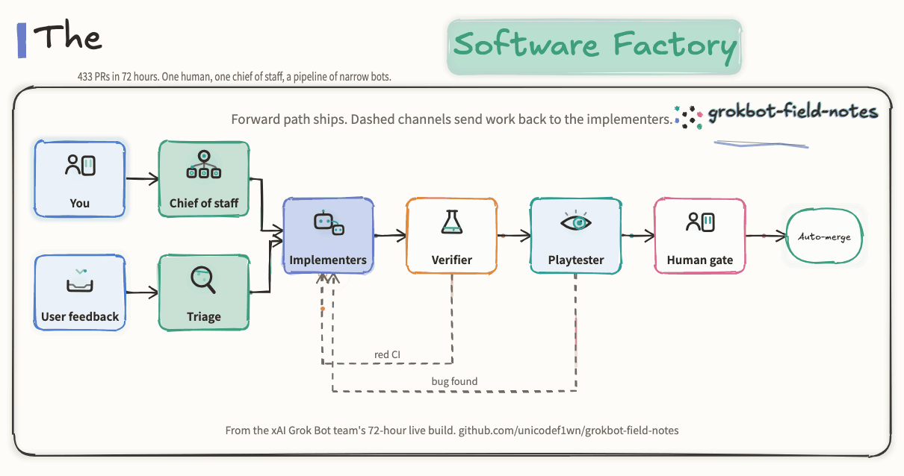

# ORCHESTRATION.md

**Use when:** you are designing a team of agents rather than prompting one, or
your roster has grown past the point where you can keep track of it.

---

## The factory, in one picture

Forward path ships. Three dashed channels send work back to the implementers:
red CI (auto-fix runs for ten minutes before a human is paged), a bug the
playtester found, and a user report that triage managed to reproduce. The
human sits in two places only: the chief of staff at the start, and the gate
in front of migrations, deploys and money. Editable source in
`guide/factory/` (`spec.json`, `.excalidraw`, `.mp4`).

---

## One bot, one job

The most repeated advice across three days, from every presenter
independently. Not one general-purpose assistant — a roster of narrow
specialists you address by name.

Four reasons it wins:

1. **Context stays scoped.** Each agent has its own context limit. A generalist
   juggling four unrelated jobs burns through it and starts forgetting.
2. **You can remember who to ask.** "Our brains can't store novels either — you
   want to know who to reference."
3. **Cast into a role, the model performs better.** The feedback loop only
   tightens when the job is narrow enough for feedback to mean something.
4. **Parallelism is free.** Fire off five specialists, let them work, come back
   and synthesize.

### Writing a role

A good role spells out:

- one clear area of ownership, narrow enough to name
- the specific tools and data sources it may use
- **how** it should approach the work, not just what the work is
- what needs sign-off before it happens
- its source of truth — which teammate or document is authoritative
- a recurring schedule, if the job has one

Avoid "General Helper." Go narrow: *Talent Scout*, *Expense Manager*,
*Bug Reproduction*, *Release Notes*.

### Write principles, not incidents

The most common way a role goes bad: it gets written or amended right after a
specific failure, and the specifics get baked in permanently.

Bad role text:

> "High-level context on our studio. One job: own engineering outcomes by
> orchestrating work through [today's toolchain] and cloud agents, then
> supervising and verifying. Match your playbook and follow it."

The fix is to say, out loud, what you want instead:

> *"Read the playbook again and come up with principles this role should follow
> instead of these overly specific issues."*

---

## The bot-sprawl trap

Creating a new agent is cheap, fast and fun. That is the problem.

> "I promise you I've had way too many at some points. It's honestly more
> chaotic. You should really be questioning: why is it important that a *new*
> bot does this?"

> "Keep your team lean. You don't need 45 bots."

**Rule:** before creating an agent, check whether an existing specialist just
needs a new *skill* or *routine*. New agents cost context, setup, routines and
your attention — every one of them, forever.

Symptoms you have too many: you can't remember what one of them does; two of
them overlap; you route messages between them manually; you have agents you
haven't opened in a week.

---

## Four patterns for running more than five

### 1. The chief of staff

One agent you talk to almost exclusively. It routes to specialists and reports
back.

- **Build every other agent *through* it.** That is what gives it the context
  to route correctly later.
- It **onboards new agents itself** — messaging them the context and standards
  so you don't repeat yourself to each new hire.
- It holds "who is working on what," so specialists don't carry that overhead.
- One practitioner runs 15–20 specialists under a single chief with no middle
  layer.

Not universal. Some people prefer talking to experts directly and say so. Try
it; drop it if it adds a hop without adding value.

### 2. The playbook broadcast

One agent owns a living document of team standards. New standards are told to
**it**, once, and it propagates them to everyone else.

> "You are just thinking about what needs to be done once... the next time you
> need to add a new workflow, they populate the playbook and all engineers know
> that without you telling them individually."

Example standards to put in it:
- every PR ships with screenshots for UI, perf numbers for backend
- how urgent work is defined and handled (see below)
- what requires human approval

### 3. The staff meeting

Pull several agents into one thread to argue a decision from different vantage
points, then have the chief synthesize a recommendation.

- **Instruct them to disagree.** "It's not helpful if they just agree."
- Use it for decisions, not for routine work — group threads are talkative and
  get expensive fast.

### 4. The sub-agent army

A mid-tier agent delegates a large batch job to a swarm of low-context workers,
with output flowing back to one parent for audit. Research 200 accounts, fuzz
40 flows, summarize 100 documents. Easy to scale up and down.

---

## Standing policies beat shouting

Telling an agent "this is urgent" repeatedly makes it skip steps and guess.
Define the policy once instead:

> *"Set up a routine that checks running agents every five minutes. Check if
> they are off track — running a long sleep, or going off the goal, or being
> too conservative. Interrupt and nudge them when you find them going off."*

Same for escalation, failure handling, and what counts as blocking.

---

## The autopilot ladder

Grant autonomy in rungs, and name the rung explicitly in the instruction.

| Rung | Means | Use when |
|---|---|---|
| **Investigate** | Diagnose, report back, touch nothing | Production, unclear cause |
| **Draft** | Open a PR, wait for a human | Normal work |
| **Autopilot** | Implement, verify, merge on green | Low blast radius, good verify loop |
| **Full autopilot** | Plan, phase, implement, verify, merge | Throwaway projects only |

Pull back a rung the moment something is live. The team that invented this
ladder did exactly that on launch day — *"maybe not full autopilot, do we
dare?"* — because the game was now in front of real users.

---

## Organising the roster

- **Sections** group agents like an org chart: Leadership, Engineering, War Room.
- **Colour or label by function**, not by task — research, outbound, account
  work — so a glance at a thread tells you the pipeline stage.
- **Pin the three or four you actually use daily.** Hide the rest rather than
  deleting them.

---

## The cost model

Consumption-based: you pay for talking to agents and for their tool use. Four
places the money actually goes:

1. **Over-frequent routines — the biggest leak by far.** "If you have three
   that run every 15 minutes, that's hundreds of messages a day." Audit
   frequency weekly. Prefer event triggers over schedules. Once or twice a day
   is usually enough.
2. **Browser automation where an API exists.** Watch the agent do it once
   through the browser, ask it to inspect the network requests it triggered,
   then have it hit those endpoints directly from then on.
3. **Group threads left running.** Agents in a shared thread talk over each
   other. Prefer one-to-one for routine work.
4. **Roster sprawl.** More agents means more routines, more re-established
   context, more overlap.

Levers you control: verbosity, telling agents to forget context they no longer
need, and keeping one agent whose only job is optimizing the others' routines
and skills.

---

## The problem nobody had solved

> "I am getting more work done than ever. I'm also busier than ever."

Context-switching across a dozen running agents is a real cost with no clean
answer yet. The chief-of-staff pattern is the best available mitigation, not a
fix. Budget attention like you budget tokens.
